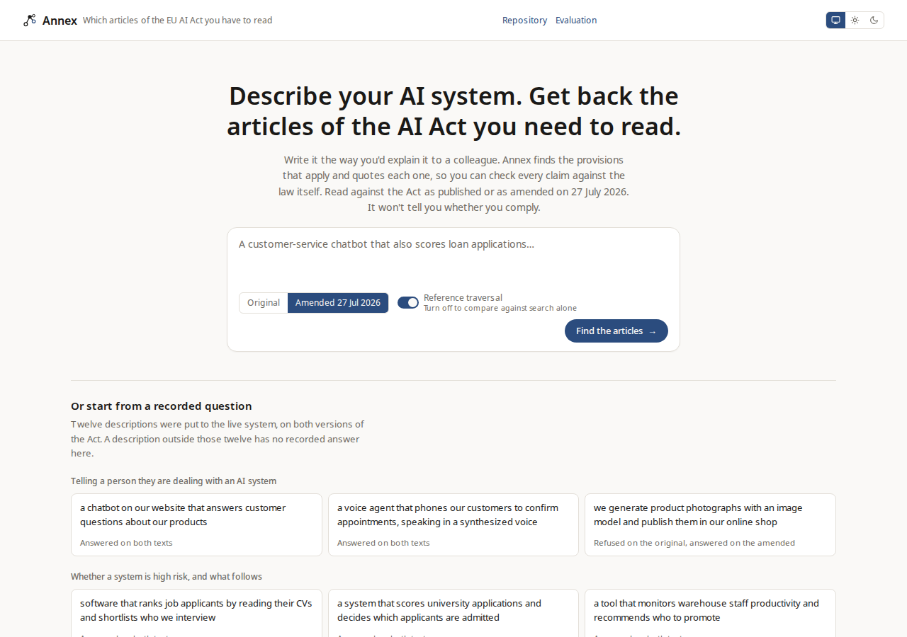

<p align="center">
  <picture>
    <source media="(prefers-color-scheme: dark)" srcset="docs/images/mark-dark.svg">
    
  </picture>
</p>

<h1 align="center">annex</h1>

<p align="center"><a href="https://github.com/erclx/annex/actions/workflows/deploy.yml?query=branch%3Amain"></a></p>

<p align="center">Describe the AI system you're building and get back the articles of the EU AI Act you have to read, each one quoted, with a refusal when the text doesn't settle it.</p>

<p align="center"><a href="https://annex.erclx.dev"><b>Try it at annex.erclx.dev</b></a><br>The deployed page replays recorded answers, so nothing there calls a model.</p>

<picture>
  <source media="(prefers-color-scheme: dark)" srcset="web/evidence/readme/dark.png">
  
</picture>

It won't tell you whether you comply. That's a judgment about your system that no text answers. It tells you where to look and shows you what it read.

## Why this exists

The Act decides things in one place and states the consequences in another. Whether a CV-screening tool counts as high-risk is decided in Article 6, which points at a list in Annex III. What you then have to do sits in Articles 8 to 15, and how you prove it is Article 43. Four articles to read, and the phrase "CV screening" appears in only one of them.

That's the interesting part. The Act writes its cross-references into its own sentences, so the links between provisions can be parsed rather than guessed at. Parsing the original text yields 523 of them and the amended text 607, and following them two steps out from Article 6 reaches every one of Articles 8 to 15 along with Article 43, in both versions.

## The question behind it

The Act is 90,483 words. Put through the model this project runs, the original text comes back as 114,720 tokens and the amended text as 77,040, both inside a context window this machine holds on the GPU. So a model can read the whole thing and answer from it, and prompt caching removes most of the cost argument for repeated questions.

So retrieval is not obviously worth doing here. This project exists to find out whether it is. The same questions run three ways:

1. Put the whole Act in the context window
2. Retrieve by meaning alone
3. Retrieve by meaning, then walk the cross-references outward

Each arm reports accuracy and cost. The answer is allowed to be that the first one wins, and reporting that is the point rather than a failure of it.

## Status

### What works

- **The command line** answers a description with the provisions to read, each quoted, or a refusal naming what the text leaves open
- **The web page** streams each step as the agent finishes it, then shows every claim with the provision it rests on quoted underneath, and opens the Act itself beside the answer. A backend that's down, slow, or erroring lands as one of four named states rather than a stalled spinner, and both are covered in `canon/wireframes/answer.md` and `canon/context/service.md`
- **The deployed page** replays twelve recorded questions on both versions of the Act, and says it's a recording on every screen

### What the evaluation found

The same twelve questions ran three ways on one RTX 5090, 72 runs in all.

| Arm                             | Recall, original | Recall, amended | Prompt tokens, original |
| ------------------------------- | ---------------- | --------------- | ----------------------- |
| Whole Act in the prompt         | 1.00             | 1.00            | 1 416 797               |
| Search only                     | 0.61             | 0.71            | 51 622                  |
| Search plus reference traversal | 0.83             | 0.81            | 193 575                 |

The baseline won on recall. Retrieval's case is cost and checkability: search with the walk sends about a seventh of the baseline's prompt tokens, and the exact passages it sent are known, so a citation can be checked against them. [docs/evaluation.md](docs/evaluation.md) has the full results, the depth sensitivity, the prompt-cache measurement, and how to reproduce them.

### Where it falls short

- **Refusal is the weakest result.** The arms refused correctly on 5 of 18 questions the text doesn't settle, though only one refusal was wrong
- **The prompt budget cuts what the walk finds.** On the original text the walk reaches 0.89 of the provisions a correct answer needs, and the model is shown 0.83

## The deployed page is a recording

[annex.erclx.dev](https://annex.erclx.dev) replays answers this system already gave. It is not asking a model, and it says so in a band on every screen.

That is what a deployment can honestly be here. The generation model holds 30 GB of a card and nothing hosted answers these questions for free, so `uv run python -m annex capture` puts the twelve evaluation questions through the real pipeline on both texts, keeps the answers, and commits them. The page reads those, and plays each recording's steps and walk before its answer at a pace it labels as illustrative, since a recording keeps what each step reached and not when. Type something the recording does not hold and it says so rather than answering with text a model produced for a different question.

Both texts were captured, so the version toggle is live there and the amendment comparison works. The reference-traversal switch is not, because the capture ran with the walk on and both positions would return one answer. [docs/demo-script.md](docs/demo-script.md) is the walkthrough against the live local system, which is the only thing a recording cannot prove about itself.

## Setup

Requires [bun](https://bun.sh), [uv](https://docs.astral.sh/uv/), and [Ollama](https://ollama.com) with `qwen3.8:27b` and `snowflake-arctic-embed2` pulled. Everything runs locally and nothing calls a paid API.

```bash
bun install
cd python && uv sync
bash scripts/ollama-build.sh   # the models, built with the context each needs
uv run python -m annex embed   # the vector index, about 30 seconds
cd .. && bun run check
```

The Ollama build step is not optional. Its `/v1` route accepts a per-request context length and ignores it, so the setting is carried by a tracked Modelfile instead, and the client refuses to run against a model that does not have it. It builds two models: `annex-qwen3-27b` at a 32,768-token window for answering from a retrieval result, and `annex-longctx` at 131,072 for the evaluation arm that reads the whole Act.

## Usage

```bash
cd python
uv run python -m annex ask "a chatbot that answers customer questions"
uv run python -m annex search "transparency obligations" --k 5
uv run python -m annex ask "..." --version original --no-traversal
uv run python -m annex context   # what context the models are carrying
uv run python -m annex evaluate  # the three arms over the question set
```

The evaluation is a long run. Three arms over twelve questions and two versions is 72 model calls, and the baseline reads the whole Act on 24 of them. `--arm`, `--version` and `--limit` narrow it, `--report-only` re-renders the last run, and results are written after every question so a run stopped halfway is still readable.

```bash
cd python && uv run python -m annex serve  # the answer endpoint on 4200
cd web && bun run dev             # the answer surface
bun run check                     # verify chain over both halves
cd python && uv run pytest -m live  # the tests that need the model up
cd python && uv run python -m annex capture  # record the answers the deployed page replays
```

The surface calls the endpoint, so both have to be running to ask a question in a browser. A service that is down, slow, or erroring surfaces as a named state on the page rather than as a stalled spinner.

## How it's put together

`web/` is a Next.js app, `python/` is a uv-managed package, and one `bun run check` at the root covers both. The retrieval index is one `sqlite-vec` file and the reference graph is an in-process map, because 806 provisions and 607 edges do not need a database and standing one up would be the wrong signal.

A question runs through five stages. It is restated in the Act's own vocabulary, searched against the index, expanded over the citations the retrieved provisions carry, answered, and every claim checked against the text it cites. One that cannot be grounded is dropped rather than softened. An answer with nothing left becomes a refusal, and so does an answer to a question about when an obligation applies that gives no date the text it cites carries.

`docs/evaluation.md` carries the measured comparison between the three arms and how to reproduce it. `canon/ARCHITECTURE.md` carries the decisions and what's still open. `canon/REQUIREMENTS.md` carries the scope. `canon/context/ai-act.md` carries the corpus itself: the amended deadlines, the reference structure, and the claims this project does not make. `canon/context/retrieval.md` carries the chunking rule, the traversal decision and the measurements behind both. `canon/wireframes/answer.md` carries the answer surface and every state it has to show, and `canon/DESIGN.md` the tokens behind it.

## What it doesn't do

- Give legal advice, or say whether you comply
- Take your own documents. The corpus is the Act and nothing else
- Cover national implementations beyond Swedish guidance
- Remember you, or save anything between visits

## Help

Open an issue. `canon/context/` carries the per-domain detail if you're working on it rather than using it.
